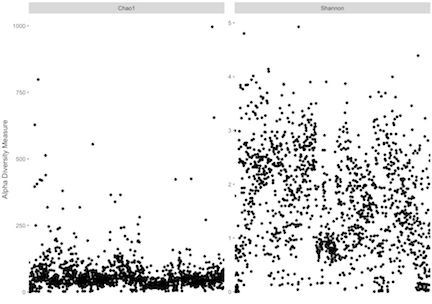
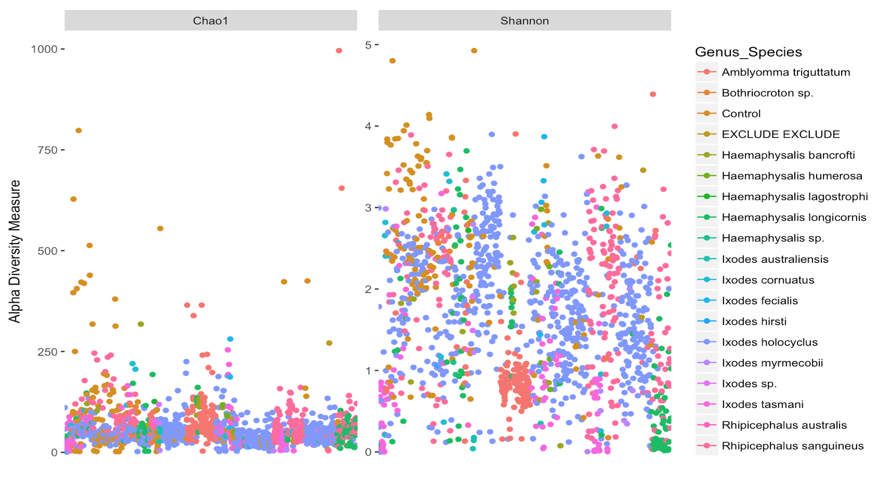
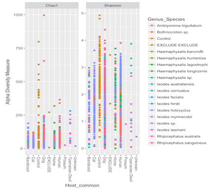

Following the [phyloseq alpha diversity examples](https://joey711.github.io/phyloseq/plot_richness-examples.html)

### Prune taxa

For this purposes I have taken the subset that includes samples only (i.e. excluded controls). Here we prune OTUS that are not present in any of the samples – BUT DON’T TRIM MORE THAN THAT! Many richness estimates are modeled on singletons and doubletons in the abundance data. You need to leave them in the dataset if you want a meaningful estimate.

```{r, eval=FALSE}
physeq_prune <- prune_species(speciesSums(physeq1) > 0, physeq1)
```
```
## Warning: 'prune_species' is deprecated.
## Use 'prune_taxa' instead.
## See help("Deprecated") and help("phyloseq-deprecated").

## Warning: 'speciesSums' is deprecated.
## Use 'taxa_sums' instead.
## See help("Deprecated") and help("phyloseq-deprecated").

```
### Plot Examples

You can produce a range of alpha diversity estimates, however it is often slow to sped things up we'll just use `Chao1` and `Shannon`. Other include: `Observed`, `ACE`, `Simpson`, `Fisher` etc.

```{r, eval=FALSE}
p = plot_richness(physeq_prune, measures=c("Chao1", "Shannon"))
```

If you have a lot of samples it can look nicer to remove x axis and labels
```{r, eval=FALSE}
p + theme(axis.title.x=element_blank(),
      axis.text.x=element_blank(),
      axis.ticks.x=element_blank())
```



# Colour samples by a variable

You may want to color your samples depending on a factor:
```{r, eval=FALSE}
p = plot_richness(physeq_prune, measures=c("Chao1", "Shannon"), color = "Genus_Species")
p + theme(axis.title.x=element_blank(),
      axis.text.x=element_blank(),
      axis.ticks.x=element_blank())
```



# Separated by variable

You may also want to group samples based on a factor, which you can overlay ontop of the color factor.

```{r, eval=FALSE}
p = plot_richness(physeq_prune, x="Host_common", measures=c("Chao1", "Shannon"), color = "Genus_Species")
p
```


<br></br>
### Alpha diversity in microbiome

Additionally the [microbiome package](http://microbiome.github.io/microbiome/Diversity.html) allows further options on alpha diversiy

This returns a table with selected diversity indicators
```{r, eval=FALSE}
tab_alpha <- diversities(samples_only, index = "all")
head(tab_alpha)
```
```
        inverse_simpson gini_simpson  shannon    fisher coverage
Sample1        8.312981    0.8797062 2.994656 14.381426        3
Sample2        2.956049    0.6617106 1.706885  4.509570        1
Sample3        9.076785    0.8898288 2.632313  4.932194        4
Sample4        5.562666    0.8202301 2.350704  6.644247        2
Sample5        4.418682    0.7736882 2.395877  5.964442        2
Sample6        2.961176    0.6622964 1.748629  8.315854        1
```


