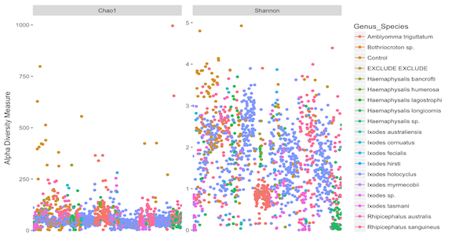

Following the [phyloseq alpha diversity examples](https://joey711.github.io/phyloseq/plot_richness-examples.html)

All (samples and control) prune > 0
```{r, eval=FALSE}
physeq_prune <- prune_species(speciesSums(physeq1) > 0, physeq1)
```

```{r, eval=FALSE}
p = plot_richness(physeq_prune, measures=c("Chao1", "Shannon"))
```

Remove x axis and label
```{r, eval=FALSE}
p + theme(axis.title.x=element_blank(),
      axis.text.x=element_blank(),
      axis.ticks.x=element_blank())
```


# Colour samples by a variable
```{r, eval=FALSE}
p = plot_richness(physeq_prune, measures=c("Chao1", "Shannon"), color = "Genus_Species")
p + theme(axis.title.x=element_blank(),
      axis.text.x=element_blank(),
      axis.ticks.x=element_blank())
```

