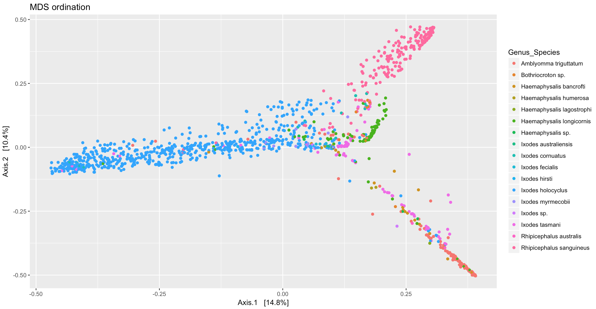
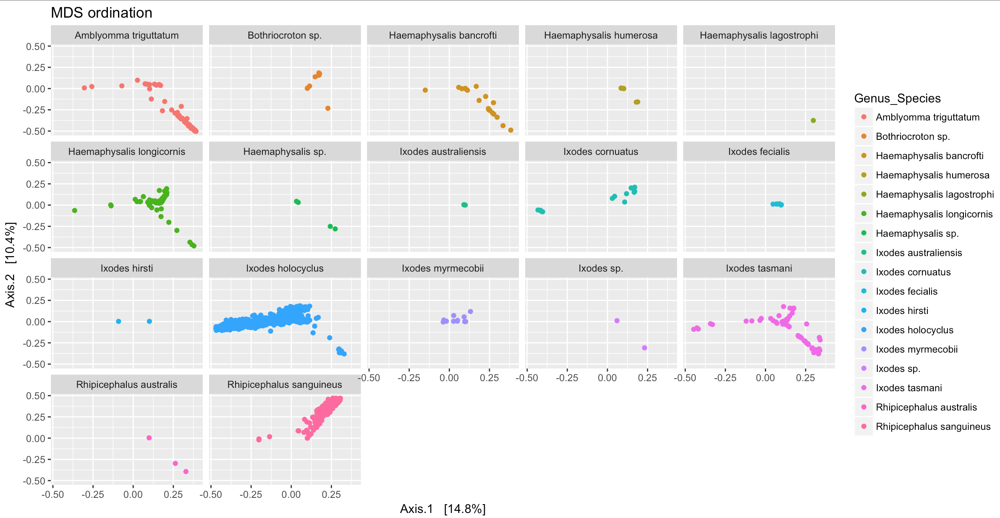

There are many different options when it comes to beta diversity analayis and plot ordination. The phyloseq documentation is a good place to start to understand the different types of analysis. You can also use the help function in r `?ordinate` and `?plot_ordination`. 

The operation of the plot_ordination function also depends a lot on the:
[Distance](https://joey711.github.io/phyloseq/distance.html) and [Ordinate](https://joey711.github.io/phyloseq/ordinate.html) functions.

The `subset_ord_plot` function is a “convenience function” intended to make it easier to retrieve a plot-derived `data.frame` with a subset of points according to a `threshold` and `method`. The meaning of the `threshold` depends upon the `method`. Phyloseq examples are avilable [here](http://joey711.github.io/phyloseq/subset_ord_plot-examples).


In this workflow we will use the plot ordinate feature to determine what variables affect the diversity of the tick microbiome.


### MDS on Bray Distances

```{r eval=FALSE}
ord_MDS <- ordinate(samples_only, "MDS", "bray")
p <- plot_ordination(samples_only, ord_MDS, type = "samples", color = "Genus_Species", shape = "Tick_Instar", title = "MDS ordination") + geom_point(size = 1)
print(p)
```



To facet the figure by a variable use ggplot command `facet_wrap`

```{r eval=FALSE}
p + facet_wrap(~Genus_Species)
```



Another way that is useful to group samples is to use ggplot geom_polygon feature, however this is best used when there are only a few samples to plot and all samples of the same variable group closely together.

```{r eval=FALSE}
p2 <- plot_ordination(samples_only, ord_MDS, type="samples", color="Genus_Species")
p2 + geom_polygon(aes(fill=Genus_Species)) + geom_point(size=1) + ggtitle("Genus_Species")
```

***

### MDS (“PCoA”) on Unifrac Distances

Use the ordinate function to simultaneously perform weightd UniFrac and then perform a Principal Coordinate Analysis on that distance matrix (first line). Next pass that data and the ordination results to plot_ordination to create the ggplot2 output graphic with default ggplot2 settings.

The first line of code to ordinate the data can take a long time for large datasets

```{r eval=FALSE}
ord_PCoA_unifrac = ordinate(samples_only, "PCoA", "unifrac", weighted=TRUE)
plot_ordination(samples_only, ordu, color="Genus_Species", shape="Tick_Instar")
```

