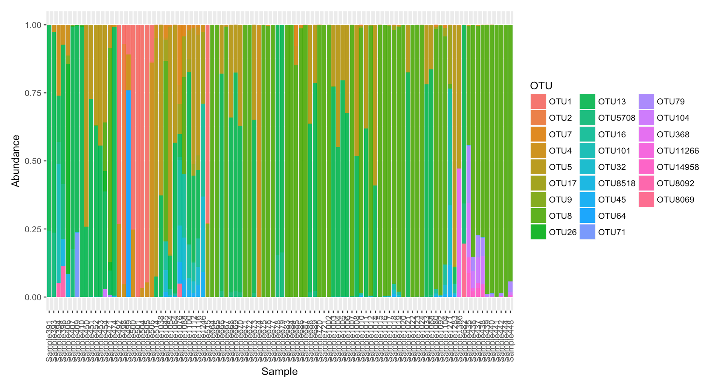
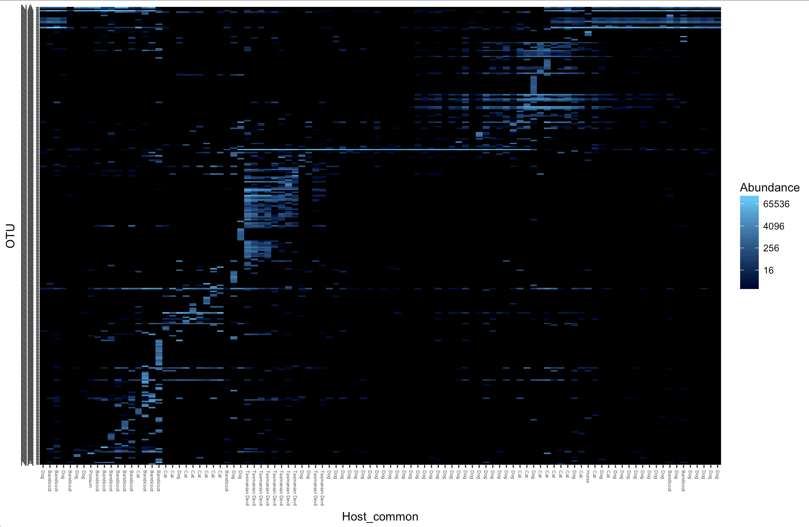

Load libraries
```{r eval=FALSE}

library("phyloseq")
library("tidyverse")
library("readr")
library("ape")
library("plyr")
library("microbiome")
```

For large data sets, it is best to sub-set your data into smaller sections to first visualise what is going on and to ensure scripts are working.

For examples lets subset the original phyloseq object to just include *Ixodes tasmani* samples.

```{r eval=FALSE}
tasmani <- rownames(subset(meta(physeq1), Tick_Species == "tasmani"))
tasmani <- prune_samples(tasmani, physeq1)
nsamples(tasmani)
ntaxa(tasmani)
```

For aesthetic purposes it is best to prune the taxa to only include the more abundant taxa, have a play around with this figure - in this case we used 100, but you may want to adjust this depending on the number of taxa in the sampleset.
```{r eval = FALSE}
tasmanifilt = filter_taxa(tasmani, function(x) mean(x) > 100, TRUE)
ntaxa(tasmanifilt)
```

**Abundance data**
```{r eval=FALSE}
pcomp <- plot_composition(tasmanifilt,
                      taxonomic.level = "OTU",
                      sample.sort = "Host_common",
                      x.label = "Host_common") +
  guides(fill = guide_legend(ncol = 1))
pcomp
```


**Compositional data**
```{r eval = FALSE}
p <- plot_composition(tasmanifilt,
                      taxonomic.level = "OTU",
                      sample.sort = "Host_common",
                      x.label = "Host_commonr", transform = "compositional") +
  guides(fill = guide_legend(ncol = 3))
p
```


***

For Large datasets however this can often not be a useful way to show the microbial composition of the samples. Here we will use heat maps to show the relative abundance of taxa in samples

### Heat maps

Here we use the *Ixodes tasmani* subset for quicker graphing

```{r eval=FALSE}
tasmani <- subset_samples(physeq1, Tick_Species== "tasmani")
```

Then we will filter the top 300 OTUs
```{r eval=FALSE}
tasmani_300 <- prune_taxa(names(sort(taxa_sums(tasmani),TRUE)[1:300]), tasmani)
plot_heatmap(tasmani_300, sample.label="Host_common")
```




We can then subset a smaller set based on taxa
```{r eval=FALSE}
tasmani_Alphapro <- subset_taxa(tasmani, Class=="Alphaproteobacteria")
plot_heatmap(tasmani_Alphapro)
```
