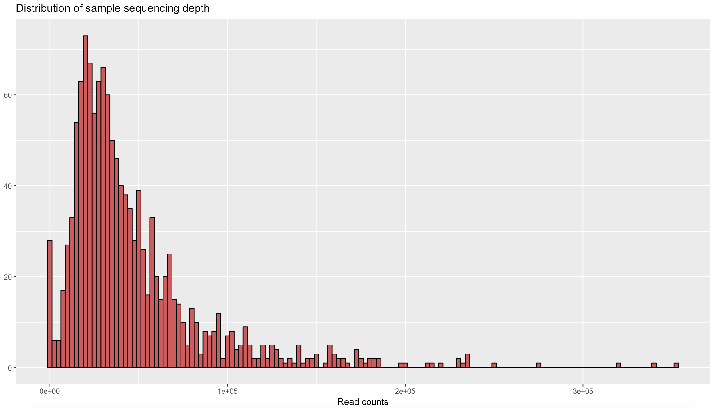

### Pre-processing data
The phyloseq package also includes functions for filtering, subsetting, and merging abundance data. Filtering in phyloseq is designed in a modular fashion similar to the approach in the genefilter package. This includes the prune_taxa and  prune_samples methods for directly removing unwanted indices, as well as the filterfun_sample and genefilter_sample functions for building arbitrarily complex sample-wise filtering criteria, and the filter_taxa function for taxa-wise filtering. You can try experimenting with different combinations of these functions. For example you may want to filter by sample, then by taxa. Use the basic commands functions to explore the different in the sub-sets.

Sub-set samples - exlude controls
You will likely want to subset your dataset so that you only analyse your samples, i.e. exclude any PCR or extraction controls. Of course I recommend you check these samples first to ensure there is not important taxa in these samples. For example in the case of tick microbiome, we know there are certain tick-associated bacteria that we do not want to see in our control samples - otherwise this would indicate contamination.

***

**Subset your samples (i.e. exclude controls)**
```{r eval=FALSE}
samples_only <- subset_samples(physeq1, Sample_Type == "Sample")
```

**Subset controls**
```{r eval=FALSE}
controls <- subset_samples(physeq1, Sample_Type == "Control")
```

Check the number of samples in your `sample_only` object compared to your entire `physeq1` and `control` objects.
```{r eval=FALSE}
nsamples(physeq)
nsamples(samples_only)
nsamples(control)
```
***

### Transforming and filtering data
In the following example, the `Physeq1` object is first transformed to relative abundance, creating the new `PHr` object, which is then filtered (`PHfr` object) such that only OTUs with a mean greater than 10^-5 are kept.
```{r eval=FALSE}
PHr  = transform_sample_counts(physeq1, function(x) x / sum(x) )
PHfr = filter_taxa(PHr, function(x) mean(x) > 1e-5, TRUE)
```
Remeber you can check the number of taxa at any stage by
```{r eval=FALSE}
ntaxa(PHr)
ntaxa(PHfr)
```

**Remove rare taxa**
Remove taxa not seen more than 3 times in at least 20% of the samples. This protects against an OTU with small mean & trivially large C.V.

```{r eval=FALSE}
physeq1ft <- filter_taxa(physeq1, function(x) sum(x > 3) > (0.2*length(x)), TRUE)
```

**Standardise abundances**

Standardize abundances to the median sequencing depth
```{r eval=FALSE}
total = median(sample_sums(physeq1ft))
standf = function(x, t=total) round(t * (x / sum(x)))
physeq1stf = transform_sample_counts(physeq1ft, standf)
```
***

### Subsetting data by taxa
Here we can subset data based on taxa, and alter the threshold of abundance. This is particularly useful when you want to test what the threshold is for a "positive sample" in your NGS data.

Remember that the `Class=="Taxa"` needs to be spelt as it appears in the taxmat object. For example if you imported your taxaonomy file from Greengenes it is formatted like: `c__Taxa`, where the letter prefix refers to the heirachy. See the note under the importing of the taxonomy table.
```{r eval=FALSE}
c_Alphaprob = subset_taxa(physeq1, Class=="Alphaproteobacteria")
c_Alphaprob = prune_samples(sample_sums(c__Alphaprob)>=20, c__Alphaprob)

g_Borrelia = subset_taxa(physeq1, Genus=="Borrelia")
g_Borrelia = prune_samples(sample_sums(g_Borrelia)>=1, g_Borrelia)

f_Bartonellaceae = subset_taxa(physeq1, Family=="Bartonellaceae")
f_Bartonellaceae = prune_samples(sample_sums(f_Bartonellaceae)>=1, f_Bartonellaceae)
```

***

### Rarefying data

<div class="alert alert-block alert-info">
Please note that the authors of phyloseq do not advocate using this as a normalization procedure, despite its recent popularity. See McMurdie and Holmes 2015 PLoS Comput. Biol. or `?rarefy_even_depth` in your R environment
You will need to experiment with this line of code in order for it to make biological sense to your data set. We recommend reading the reference above about Rarefying microbial datasets.</div>

```{r eval=FALSE}
physeq1.rarified <- rarefy_even_depth(physeq1)
ntaxa(physeq1.rarified)
nsamples(physeq1.rarified)
rm(physeq1.rarified)
physeq1.rarified <- rarefy_even_depth(physeq1, rngseed = 1000)
ntaxa(physeq1.rarified)
nsamples(physeq1.rarified)
```

***

### Sampling depth

Credit to [MicrobMiseq github](http://deneflab.github.io/MicrobeMiseq/demos/mothur_2_phyloseq.html)

Make a data frame with a column for the read counts of each sample
```{r eval=FALSE}
sample_sum_df <- data.frame(sum = sample_sums(samples_only))
```
Create histogram of sample read counts
```{r eval=FALSE}
ggplot(sample_sum_df, aes(x = sum)) + 
  geom_histogram(color = "black", fill = "indianred", binwidth = 2500) +
  ggtitle("Distribution of sample sequencing depth") + 
  xlab("Read counts") +
  theme(axis.title.y = element_blank())
```

